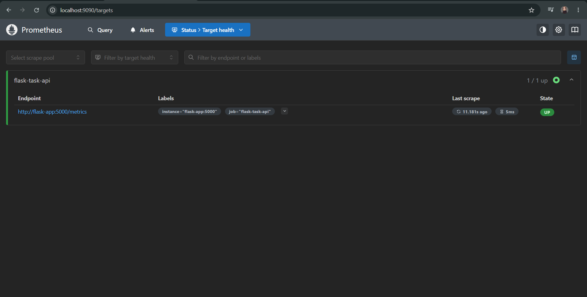
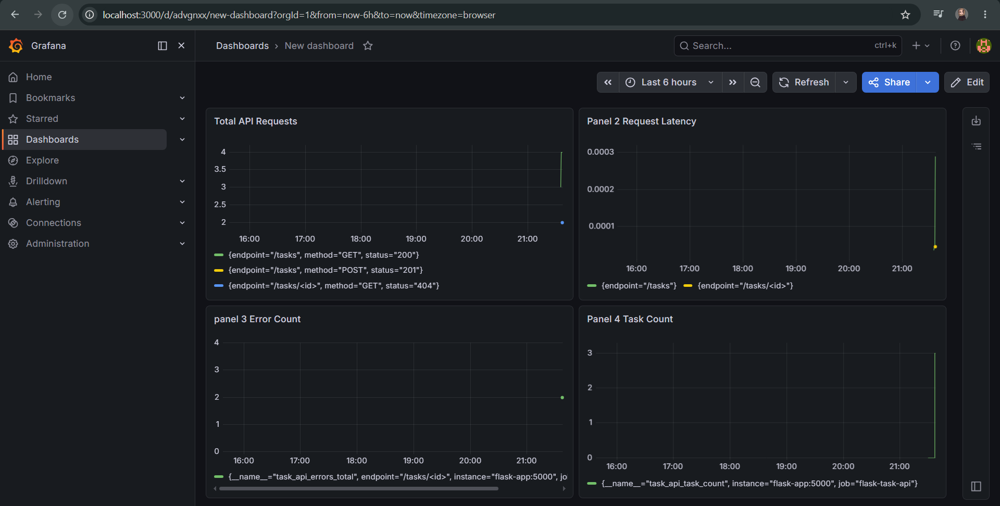

# Python Task Management API with Prometheus & Grafana Monitoring

A production-style monitoring stack built with Python Flask, Prometheus, and Grafana — fully containerized with Docker Compose.

##  Architecture

User/Client (Postman)

↓

Python Flask API :5000

↓ exposes /metrics

Prometheus :9090  ←  scrapes every 15s

↓

Grafana :3000     ←  visualizes dashboards

##  Tech Stack

- **Python / Flask** — REST API with custom Prometheus metrics
- **Prometheus** — metrics collection and storage
- **Grafana** — real-time dashboard visualization
- **Docker / Docker Compose** — containerized multi-service deployment

## 📡 API Endpoints

| Method | Endpoint | Description |
|--------|----------|-------------|
| GET | `/tasks` | Get all tasks |
| GET | `/tasks/<id>` | Get task by ID |
| POST | `/tasks` | Create a new task |
| DELETE | `/tasks/<id>` | Delete a task |
| GET | `/health` | Health check |
| GET | `/metrics` | Prometheus metrics |

##  Custom Metrics

| Metric | Type | Description |
|--------|------|-------------|
| `task_api_requests_total` | Counter | Total API requests by method, endpoint, status |
| `task_api_request_duration_seconds` | Histogram | Request latency per endpoint |
| `task_api_errors_total` | Counter | Total errors by endpoint |
| `task_api_active_requests` | Gauge | Requests currently being processed |
| `task_api_task_count` | Gauge | Total tasks in the system (business metric) |

##  How to Run

**Prerequisites:** Docker Desktop

```
docker compose up --build
```

Then open:
- Flask API → http://localhost:5000
- Prometheus → http://localhost:9090
- Grafana → http://localhost:3000 

##  Screenshots

### Prometheus Targets — Flask API being scraped successfully


### Grafana Dashboard — Live metrics visualization

